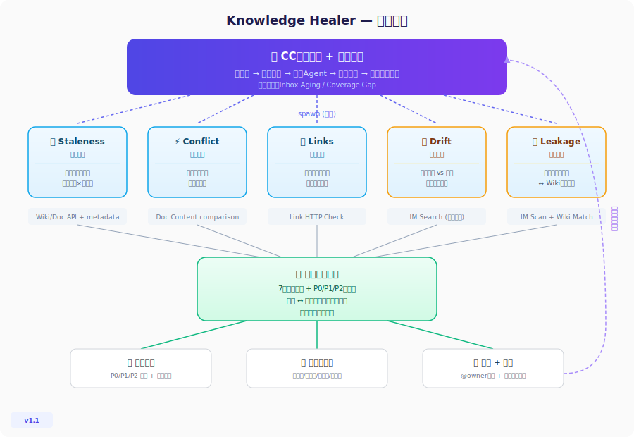
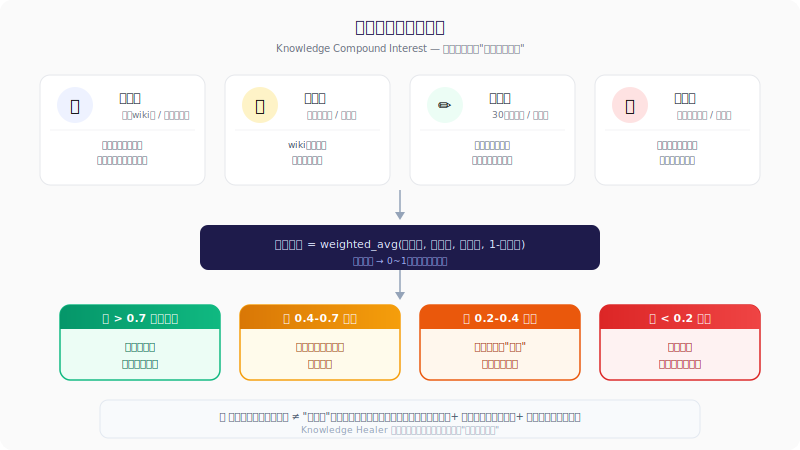

# Knowledge Healer 🩺

**知识库自愈巡检系统** — 企业知识库的免疫系统

> 不是等人发现文档过期，而是主动发现、诊断、推动修复。让知识复利真正转起来。

## 解决什么问题

企业知识库有三种死法：

1. **烂在里面** — 文档写了没人维护，新人照着过期文档操作被坑
2. **漏在外面** — 有价值的经验散落在群聊里，永远没人整理进wiki，集体智慧不积累
3. **堵在入口** — 收集了资料但扔在待处理区几个月不动，新知识进不了正式体系

三种同时发生，知识库就"名存实亡"——框架漂亮，但过期/散落/空壳。

**数据支撑**：
- 47% 知识工作者每天找不到需要的信息
- 平均每人每天浪费 1.8 小时搜索过期/散落的文档

**现有方案（人工定期审查）为什么不行**：
- 审查成本高（几百篇文档不可能逐篇看）
- 审查标准主观（什么算"过期"因人而异）
- 只能看文档本身（看不到"群里大家已经不这么做了"）
- 只管"已有文档有没有问题"，不管"该有的文档有没有"

## 核心能力

### 七维诊断

| 维度 | 检测什么 | 怎么检测 |
|------|---------|---------|
| **过期** | 文档内容不再反映当前状态 | 多信号加权：编辑时间 × 引用频率 × 外部变化信号 |
| **冲突** | 多份文档对同一事物描述不一致 | 主题聚类 → 关键断言对比 → 权威源识别 |
| **断链** | 链接指向已删除/移动的目标 | 链接有效性批量校验 + 隐式引用模糊匹配 |
| **漂移** | 文档没变但现实已变 | 跨源交叉验证：文档断言 vs 群聊讨论 vs 任务模式 |
| **管线泄漏** | 高价值知识散落在体系外 | 群聊高价值内容扫描 → 匹配wiki已有覆盖 → 未覆盖=泄漏 |
| **捕获箱老化** | 入口堵塞导致新信息无法进入体系 | 待处理内容滞留时间 + 入口流量 vs 处理速率 |
| **覆盖空洞** | 有框架无内容的"空壳区域" | 目录结构 vs 实际内容量 + 需求信号（群聊提问频率） |

### 技术亮点

- **5 Agent 并行诊断**：过期/冲突/断链/漂移/泄漏各一专家，独立判断+交叉验证
- **自校准阈值**：系统从误报/漏报反馈中学习，动态调整判定标准
- **跨数据源漂移检测**：对比文档内容 vs IM群聊 vs 任务数据，发现"文档写的"与"实际做的"之间的偏差
- **管线+空洞联动**：体系外散落的内容 + 体系内缺失的位置 = 自动匹配修复方案
- **知识复利指数**：量化知识库新陈代谢速率（录入率/引用率/更新率/泄漏率）
- **增量巡检**：基线对比机制，只检查变化部分，支持高频执行
- **闭环追踪**：检测 → 通知 → 追踪修复 → 确认 → 校准

## 使用方法

### 前置条件

- 安装 [飞书 CLI](https://github.com/AJ-Lark/feishu-cli)
- 安装 [Claude Code](https://docs.anthropic.com/en/docs/claude-code)
- 配置飞书 CLI 授权（需要 Wiki/Doc/IM 相关权限）

### 安装 Skill

```bash
# 克隆到 Claude Code skills 目录
git clone https://github.com/Evan-miwillbe/knowledge-healer.git ~/.claude/skills/knowledge-healer
```

### 使用

在 Claude Code 中输入：

```
/knowledge-healer
scope: wiki://your-space-token
project_dir: ~/Desktop/knowledge-audit
mode: full
depth: 3
```

### 执行模式

| 模式 | 适用场景 | 耗时（50篇文档） |
|------|---------|----------------|
| `full` | 首次运行 / 季度体检 | ~5分钟 |
| `quick` | 日常/周度巡检 | ~1分钟 |
| `drift-only` | 专项检测知识漂移 | ~3分钟 |
| `scheduled` | 无人值守定期巡检 | 同full，静默执行 |

### 带漂移检测的高级用法

```
/knowledge-healer
scope: wiki://your-space-token
project_dir: ~/Desktop/knowledge-audit
mode: full
depth: 3
chat_groups: ["oc_product_team", "oc_engineering"]
notify: true
baseline_path: ~/Desktop/knowledge-audit/baselines/latest.json
```

## 输出示例

```
📋 知识库健康报告 2026-05-05
━━━━━━━━━━━━━━━━━━━━━━━━━━━
健康评分：72/100 (↑5 vs上次)
知识复利指数：0.45 🟡 增长放缓
文档总数：156 篇

┌────────────┬──────┬────┬────┬────┐
│ 类别       │ 总数 │ P0 │ P1 │ P2 │
├────────────┼──────┼────┼────┼────┤
│ 过期       │  12  │  2 │  5 │  5 │
│ 冲突       │   3  │  1 │  2 │  0 │
│ 断链       │   8  │  0 │  3 │  5 │
│ 漂移       │   4  │  2 │  2 │  0 │
│ 管线泄漏   │   6  │  2 │  3 │  1 │
│ 捕获箱老化 │   5  │  0 │  2 │  3 │
│ 覆盖空洞   │   4  │  1 │  2 │  1 │
└────────────┴──────┴────┴────┴────┘

🚨 P0-漂移: 报销流程文档与实际操作不一致
   证据: 3人在财务群提及"直接提交"流程
   影响: 新员工按旧流程操作被退回
   建议: @张三 更新报销SOP第3步

🚨 P0-泄漏: "如何配置VPN"在技术群被问了7次
   证据: 5人分别回答，内容高度一致但wiki无此页面
   影响: 每次新人入职都重复问+重复答
   建议: 整理群聊回答 → 创建wiki页面（预估15分钟）
```

## 架构设计



## 知识复利模型



## 设计哲学

### 为什么是"自愈"而不是"审计"

| | 传统审计 | Knowledge Healer |
|---|---------|-----------------|
| 触发 | 人工启动 | 定时自动 |
| 标准 | 固定规则 | 自校准阈值 |
| 输出 | 问题列表 | 问题+修复建议+追踪 |
| 学习 | 不学习 | 从反馈中优化判定 |
| 数据源 | 只看文档 | 跨源交叉验证 |

### 自校准：越巡越准

系统从每次巡检的反馈中学习：
- 用户标记"误报" → 放宽该类型阈值
- 发现"漏报" → 收紧阈值
- 连续3次同方向调整 → 锁定为稳定阈值

### 噪声控制原则

**宁可漏报，不可误报。**

如果巡检报告50%是误报，用户会完全忽略它（"狼来了"效应）。因此：
- 置信度<60%的漂移不进入报告
- 单一信号不直接判定为P0
- 多信号叠加才提升优先级

## 适用场景

- 📋 **季度知识盘点** — 全面体检所有文档空间
- 🆕 **新人入职保障** — 确保入职指南空间内容最新
- 🔄 **项目收尾** — 检测项目文档是否反映最终状态
- ✅ **合规审计准备** — 先自查确保文档与实际一致
- 🤝 **跨部门协作** — 发现不同部门wiki间的信息冲突
- 📈 **知识复利启动** — 找出为什么知识库"不长"的根因（入口堵？管线漏？框架空？）

## 设计灵感

- [Karpathy's LLM Wiki](https://gist.github.com/karpathy/442a6bf555914893e9891c11519de94f) — "Obsidian是IDE，LLM是程序员，Wiki是代码库"
- 知识复利理论 — 每次交互让知识库更好，而非用完即弃
- TextGrad (Nature 2025) — 批评=梯度信号，自校准机制的学术基础
- 免疫系统类比 — 巡逻细胞(扫描) + 诊断细胞(分析) + 信号细胞(通知) + 记忆细胞(校准)

## 飞书 CLI 能力依赖

本 Skill 使用以下飞书 CLI 能力：

- `lark-cli wiki` — Wiki空间遍历和节点读取
- `lark-cli doc` — 文档内容和元数据获取
- `lark-cli im` — 群聊消息搜索（漂移检测 + 管线泄漏检测）
- `lark-cli task` — 任务数据辅助判定
- `lark-cli calendar` — 日历数据辅助判定

## License

MIT
